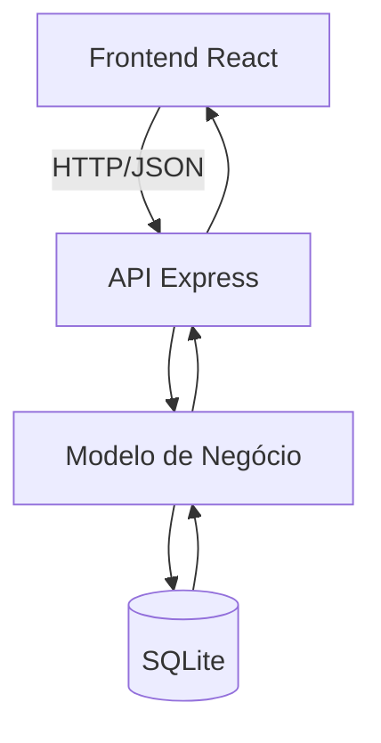

# Análise Arquitetural

## a) Identificação da Arquitetura

O sistema ESM Forum segue uma arquitetura Cliente-Servidor organizada em camadas.

Os principais estilos arquiteturais identificados são:

- Arquitetura em Camadas (Layered Architecture)
- Cliente-Servidor
- API REST

### Camada de Apresentação

Responsável pela interface do usuário.

Componentes:

- React
- Componentes de interface
- Formulários de perguntas e respostas

### Camada de Negócio

Responsável pelo processamento das regras da aplicação.

Componentes:

- server.js
- modelo.js

Responsabilidades:

- Cadastro de perguntas
- Cadastro de respostas
- Consulta de perguntas
- Consulta de respostas

### Camada de Dados

Responsável pelo armazenamento das informações.

Componentes:

- SQLite
- bd_utils.js

Responsabilidades:

- Persistência de perguntas
- Persistência de respostas
- Consultas ao banco

## Comunicação entre Frontend e Backend

A comunicação ocorre através de requisições HTTP.

O frontend React envia requisições para a API Express utilizando JSON.

Exemplos:

- GET / → listar perguntas
- POST /perguntas → cadastrar pergunta
- GET /respostas/:id → listar respostas
- POST /respostas → cadastrar resposta

## b) Diagrama Arquitetural

Arquivo:

- arquitetura.png

Arquivo fonte:

- arquitetura.mmd

