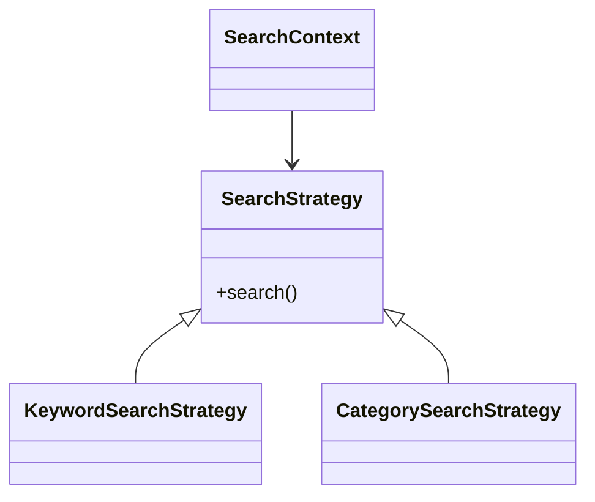
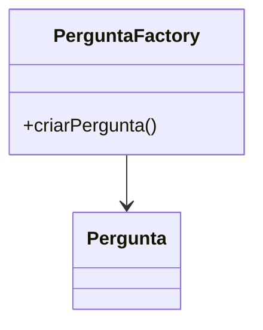
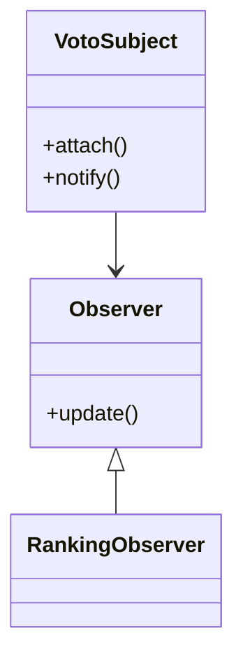

# Proposta de Aplicação de Padrões de Projeto

## Padrão 1: Strategy

### a) Justificativa e Contexto

**Funcionalidade:** Busca de perguntas por palavra-chave e por categoria.

**Problema resolvido:** Permitir diferentes formas de busca sem modificar a lógica principal da aplicação.

**Por que este padrão é adequado:** O padrão Strategy permite encapsular algoritmos de busca em classes independentes, facilitando a inclusão de novos tipos de busca futuramente.

### b) Proposta de Solução

Seriam criadas as seguintes classes:

- SearchStrategy (interface)
- KeywordSearchStrategy
- CategorySearchStrategy
- SearchContext

Funcionamento:

- O SearchContext recebe uma estratégia de busca.
- Cada estratégia implementa sua própria lógica.
- Novas estratégias podem ser adicionadas sem alterar o código existente.

### Diagrama UML

Arquivo: `strategy_diagrama.png`

Arquivo fonte: `strategy_diagrama.mmd`



### c) Exemplo de Código

```javascript
class SearchStrategy {
  search(termo) {}
}

class KeywordSearchStrategy extends SearchStrategy {
  search(termo) {
    return perguntas.filter(p =>
      p.texto.includes(termo)
    );
  }
}

class SearchContext {
  constructor(strategy) {
    this.strategy = strategy;
  }

  executarBusca(termo) {
    return this.strategy.search(termo);
  }
}
```

---

## Padrão 2: Factory

### a) Justificativa e Contexto

**Funcionalidade:** Criação de perguntas.

**Problema resolvido:** Centralizar a criação de objetos Pergunta.

**Por que este padrão é adequado:** Facilita a manutenção e evita repetição de código para criação de perguntas.

### b) Proposta de Solução

Seriam criadas as seguintes classes:

- PerguntaFactory
- Pergunta

Funcionamento:

- A criação de perguntas passa pela fábrica.
- Regras de inicialização ficam centralizadas.
- Mudanças futuras não afetam o restante do sistema.

### Diagrama UML

Arquivo: `factory_diagrama.png`

Arquivo fonte: `factory_diagrama.mmd`



### c) Exemplo de Código

```javascript
class PerguntaFactory {
  criarPergunta(texto, usuario) {
    return {
      texto: texto,
      usuario: usuario,
      dataCriacao: new Date()
    };
  }
}
```

---

## Padrão 3: Observer

### a) Justificativa e Contexto

**Funcionalidade:** Sistema de votação em perguntas.

**Problema resolvido:** Atualizar automaticamente componentes relacionados após um voto.

**Por que este padrão é adequado:** Permite que diversos elementos sejam notificados quando uma votação ocorre.

### b) Proposta de Solução

Seriam criadas as seguintes classes:

- VotoSubject
- Observer
- RankingObserver

Funcionamento:

- O VotoSubject mantém uma lista de observadores.
- Quando um voto é registrado, todos os observadores são notificados.
- Cada observador executa sua atualização.

### Diagrama UML

Arquivo: `observer_diagrama.png`

Arquivo fonte: `observer_diagrama.mmd`



### c) Exemplo de Código

```javascript
class Observer {
  update() {}
}

class RankingObserver extends Observer {
  update() {
    console.log("Ranking atualizado");
  }
}

class VotoSubject {
  constructor() {
    this.observers = [];
  }

  attach(observer) {
    this.observers.push(observer);
  }

  notify() {
    this.observers.forEach(o => o.update());
  }
}
```

---

## Arquivos Entregues

### Diagramas

- strategy_diagrama.png
- factory_diagrama.png
- observer_diagrama.png

### Arquivos Fonte Mermaid

- strategy_diagrama.mmd
- factory_diagrama.mmd
- observer_diagrama.mmd
