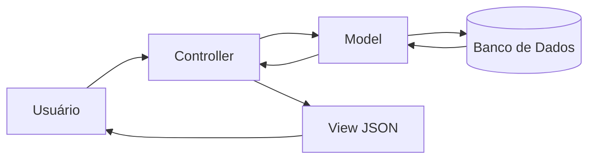

# Proposta de Organização Arquitetural

## a) Proposta de Separação em Camadas

### Camada de Apresentação

Responsável por receber e responder requisições HTTP.

Exemplos:

- PerguntaController
- RespostaController
- BuscaController

Responsabilidades:

- Receber dados do cliente
- Validar entradas
- Retornar respostas JSON

---

### Camada de Negócio

Responsável pelas regras da aplicação.

Exemplos:

- PerguntaService
- RespostaService
- BuscaService

Responsabilidades:

- Aplicar regras de negócio
- Processar operações
- Coordenar funcionalidades

---

### Camada de Dados

Responsável pelo acesso ao banco.

Exemplos:

- PerguntaRepository
- RespostaRepository

Responsabilidades:

- Executar consultas SQL
- Inserir registros
- Atualizar dados
- Recuperar informações

---

### Comunicação Entre Camadas

Fluxo:

Apresentação → Negócio → Dados

A camada de apresentação nunca acessa diretamente o banco de dados.

Toda comunicação passa pelos serviços de negócio.

---

## b) Proposta de Aplicação do MVC

### Models

Responsáveis pelos dados e regras de acesso.

Exemplos:

- PerguntaModel
- RespostaModel

Operações:

- Criar pergunta
- Criar resposta
- Buscar perguntas
- Buscar respostas

---

### Views

Responsáveis pelas respostas enviadas ao cliente.

Exemplos:

- JSON de perguntas
- JSON de respostas
- JSON de resultados de busca

---

### Controllers

Responsáveis por controlar o fluxo da aplicação.

Exemplos:

- PerguntaController
- RespostaController
- BuscaController

Responsabilidades:

- Receber requisições
- Chamar os Models
- Retornar Views

---

## Fluxo de Requisição

Exemplo: Busca de perguntas

1. Usuário informa termo de busca.
2. Frontend envia requisição HTTP.
3. BuscaController recebe a requisição.
4. BuscaController chama BuscaService.
5. BuscaService consulta PerguntaRepository.
6. Repository acessa o SQLite.
7. Resultados retornam ao Service.
8. Service retorna ao Controller.
9. Controller envia JSON ao frontend.
10. Frontend exibe os resultados.

---

## Diagrama MVC

Arquivo:

- mvc_diagrama.png

Arquivo fonte:

- mvc_diagrama.mmd

